

# PA4 Submission: TaskFlow Pipeline

Copy this file to <code style="color:#111827;background:#ddd6fe;padding:2px 4px;border-radius:4px;">SUBMISSION.md</code>. Put every screenshot in <code style="color:#111827;background:#ddd6fe;padding:2px 4px;border-radius:4px;">docs/</code>, embed it under the correct task, and write a short description below each image explaining what it proves. The grader should not need any file outside this repository.

## Student Information

| Field | Value |
|---|---|
| Name | Iyan Aamir Aslam |
| Roll Number | 27100269 |
| GitHub Repository URL | https://github.com/Ayaaaaaaaaaaaaaaaaan/CS487-PA4 |
| Resource Group | `rg-sp26-27100269` |
| Assigned Region | `ukwest` |

## Evidence Rules

- Use relative image paths, for example: ``.
- Every image must have a 1-3 sentence description below it.
- Azure Portal screenshots must show the resource name and enough page context to identify the service.
- CLI screenshots must show the command and output.
- Mask secrets such as function keys, ACR passwords, and storage connection strings.

---

## Task 1: App Service Web App (15 points)

### Evidence 1.1: Forked Repository

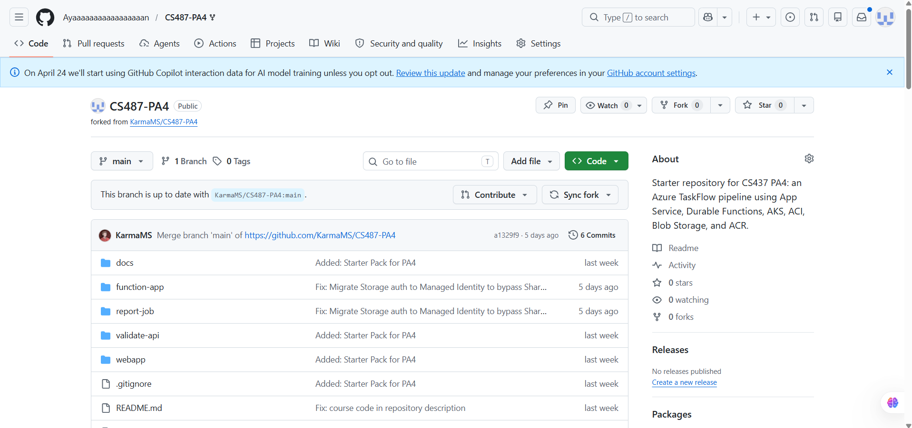

This is my working fork of the CS487-PA4 starter repository under my GitHub account `Ayaaaaaaaaaaaaaaaaan`, forked from `KarmaMS/CS487-PA4`. It contains the full PA4 starter structure including `docs`, `function-app`, `report-job`, `validate-api`, and `webapp` folders with my completed code changes pushed.

### Evidence 1.2: App Service Overview

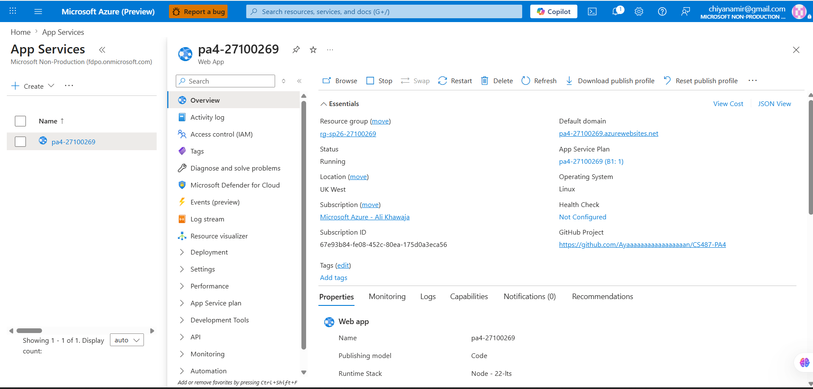

The Web App `pa4-27100269` is running in resource group `rg-sp26-27100269`, region UK West, on the B1 App Service Plan with Node 22-lts runtime. Public URL is `pa4-27100269.azurewebsites.net` and status shows Running.

### Evidence 1.3: Deployment Center / GitHub Actions

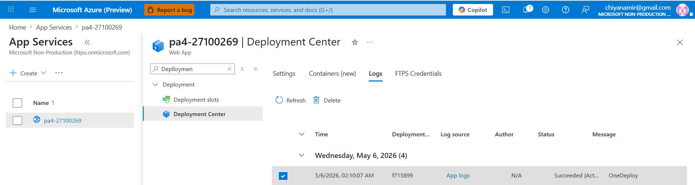

The Deployment Center shows a successful deployment on May 6, 2026 with status Succeeded, confirming the Web App is connected to my GitHub fork via GitHub Actions CI/CD.

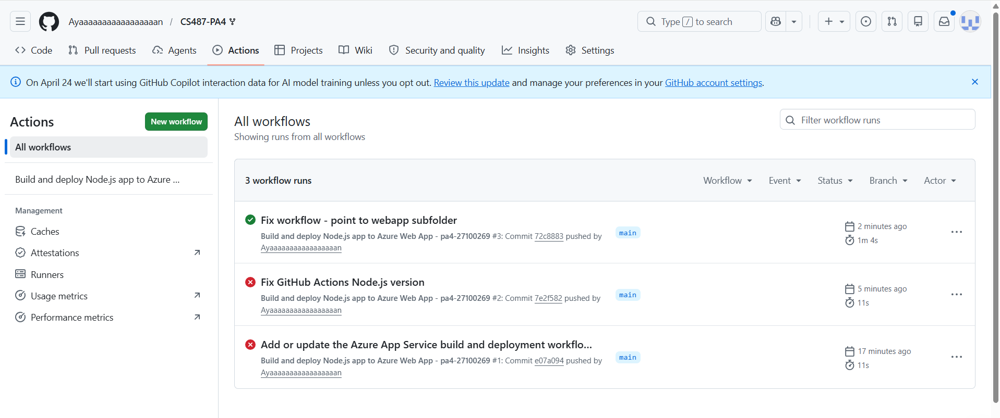

The GitHub Actions tab shows the workflow "Fix workflow - point to webapp subfolder" completed successfully (green checkmark) in 1m 4s, confirming automated deployment from GitHub to Azure App Service is fully operational.

### Evidence 1.4: Live Web UI

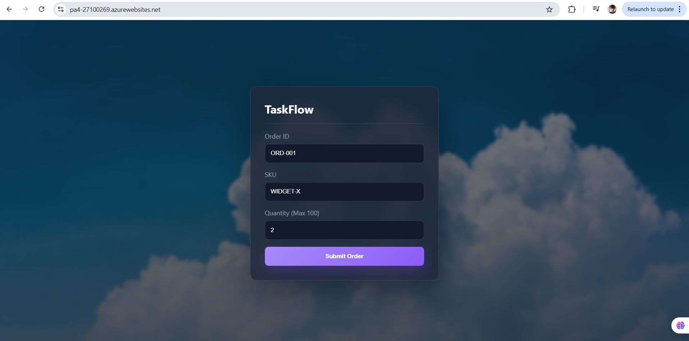

The TaskFlow frontend loads successfully at `https://pa4-27100269.azurewebsites.net` showing the order form with Order ID, SKU, and Quantity fields, confirming the App Service is serving the Node.js frontend correctly.

---

## Task 2: Azure Container Registry (15 points)

### Evidence 2.1: ACR Overview

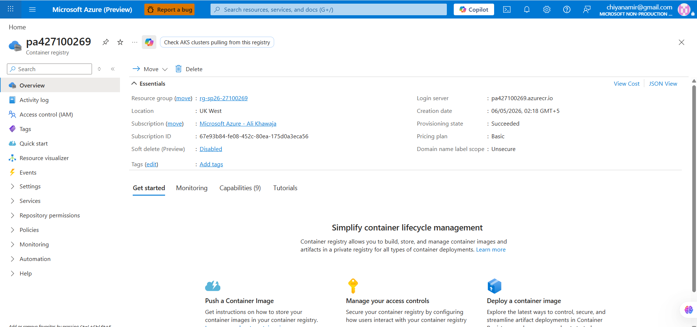

The Container Registry `pa427100269` is in resource group `rg-sp26-27100269`, UK West, with Pricing plan Basic and Provisioning state Succeeded. Login server is `pa427100269.azurecr.io`.

### Evidence 2.2: Docker Builds

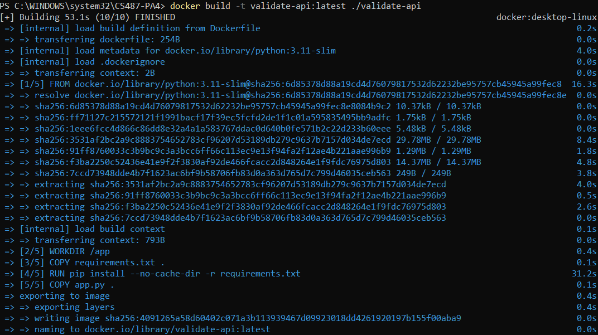

Successful build of `validate-api:latest` from `validate-api/` folder using `python:3.11-slim`, completed in 53.1s.

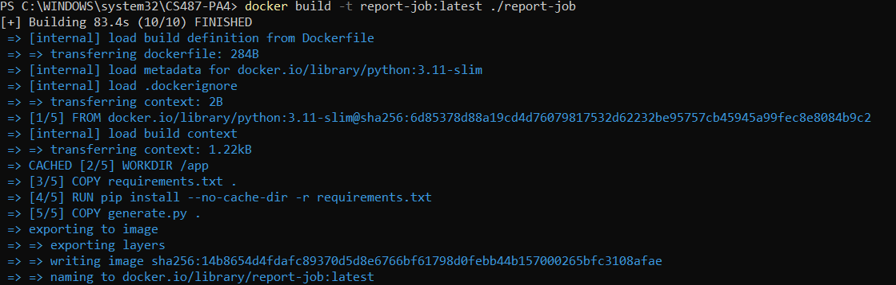

Successful build of `report-job:latest` from `report-job/` folder using `python:3.11-slim`, completed in 83.4s installing `azure-storage-blob`, `reportlab`, and `azure-identity`.

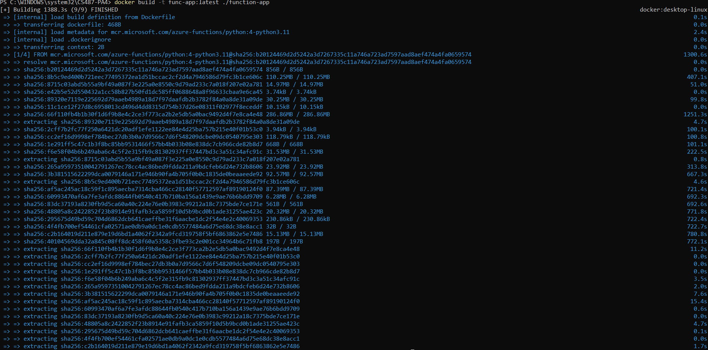

Successful build of `func-app:latest` from `function-app/` folder using the Azure Functions Python base image `mcr.microsoft.com/azure-functions/python:4-python3.11`, completed in 1388.3s.

### Evidence 2.3: ACR Repositories

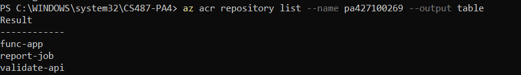

The `az acr repository list --name pa427100269 --output table` confirms all three images pushed: `func-app`, `report-job`, and `validate-api`.

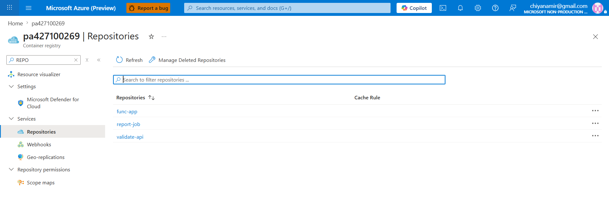

The ACR Repositories blade shows all three repositories `func-app`, `report-job`, and `validate-api` confirming `validate-api:v1`, `report-job:v1`, and `func-app:v1` were pushed successfully.

---

## Task 3: Durable Function Implementation (12 points)

### Evidence 3.1: Completed Function Code

[function_app.py](function-app/function_app.py)

The completed `function_app.py` implements the full Durable orchestration: `my_orchestrator` chains `validate_activity` (POSTs to AKS validator) and conditionally calls `report_activity` (uses Azure Container Instance SDK to spawn the report-job container, waits for completion, auto-deletes it, and returns the blob PDF URL).

### Evidence 3.2: Local Function Handler Listing

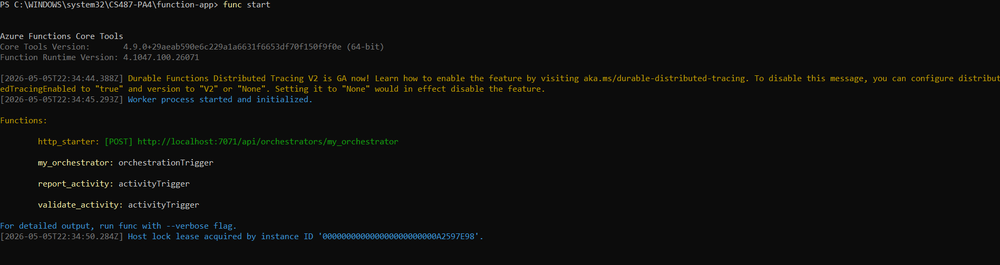

Running `func start` in `function-app/` shows all four Durable Function handlers registered: `http_starter` (HTTP trigger at `localhost:7071/api/orchestrators/my_orchestrator`), `my_orchestrator` (orchestrationTrigger), `report_activity` (activityTrigger), and `validate_activity` (activityTrigger). The Durable Functions runtime discovered all handlers successfully.

---

## Task 4: Function App Container Deployment (8 points)

### Evidence 4.1: Function App Container Configuration

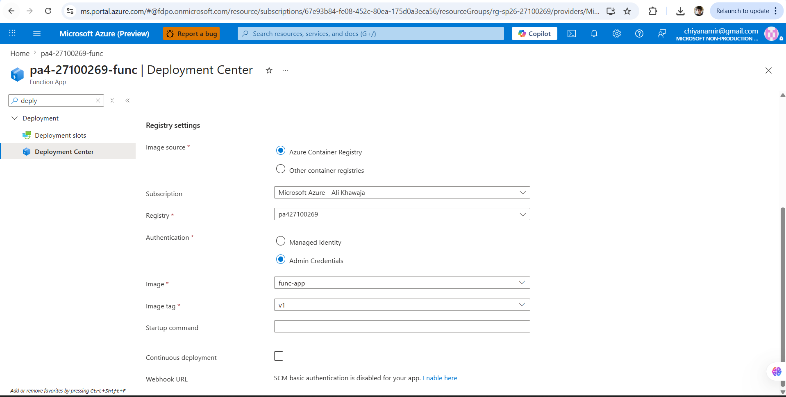

The Deployment Center of `pa4-27100269-func` shows Image source set to Azure Container Registry, Registry `pa427100269`, Image `func-app`, tag `v1`, and Authentication using Admin Credentials, confirming the Function App is pulling `pa427100269.azurecr.io/func-app:v1`.

### Evidence 4.2: Orchestration Smoke Test

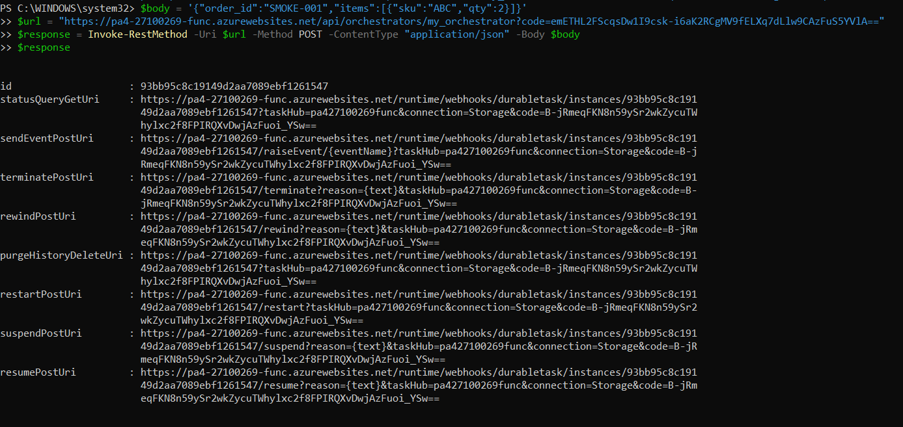

`Invoke-RestMethod` POST to the HTTP starter returns orchestration `id: 93bb95c8c19149d2aa7089ebf1261547` and a `statusQueryGetUri`, proving the Function App deployed successfully and the Durable orchestrator started correctly. The returned URLs confirm the orchestration instance is tracked in Durable storage.

### Evidence 4.3: Expected Failed Status Before Downstream Wiring

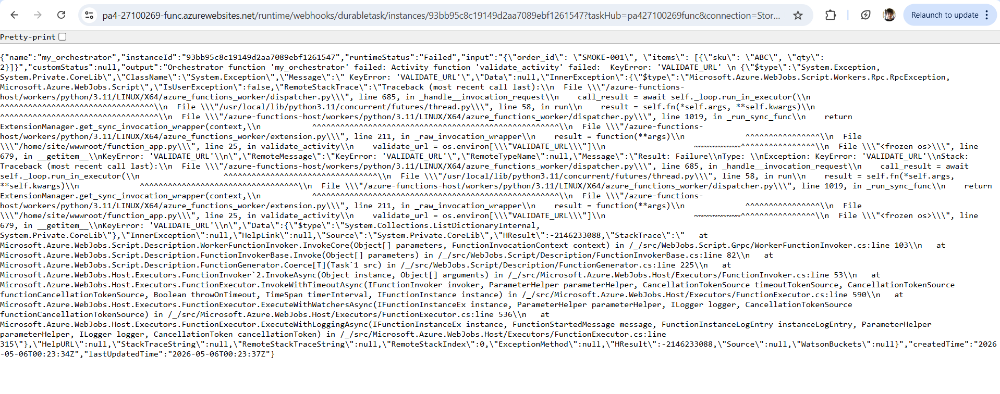

Polling the `statusQueryGetUri` shows `runtimeStatus: Failed` with error `KeyError: 'VALIDATE_URL'`. This failure is expected at this stage — the orchestrator ran correctly and reached `validate_activity`, but failed only because AKS was not yet deployed and `VALIDATE_URL` was not configured.

---

## Task 5: AKS Validator (15 points)

### Evidence 5.1: AKS Cluster

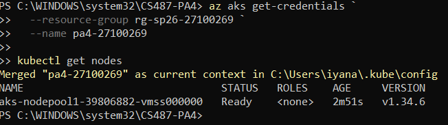

`az aks get-credentials` merged context `pa4-27100269` and `kubectl get nodes` shows node `aks-nodepool1-39806882-vmss000000` in Ready status with Kubernetes v1.34.6, confirming 1 node of size `Standard_B2s` in resource group `rg-sp26-27100269`, UK West.

### Evidence 5.2: Kubernetes Nodes and Pods

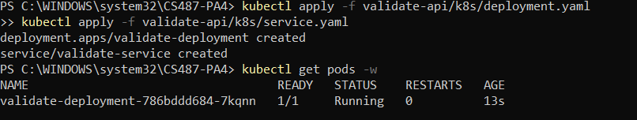

`kubectl apply` created the deployment and service, and `kubectl get pods -w` shows the `validate-deployment` pod in Running status with 1/1 containers ready and 0 restarts after 13 seconds, confirming the validator pod is scheduled and running on the AKS cluster.

### Evidence 5.3: Kubernetes Service

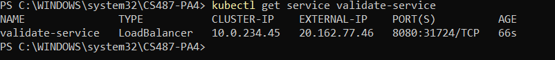

`kubectl get service validate-service` shows the LoadBalancer service with external IP `20.162.77.46` on port 8080, confirming the stable public endpoint exposed by the LoadBalancer that the Durable Function calls for every order.

### Evidence 5.4: Validator API Tests

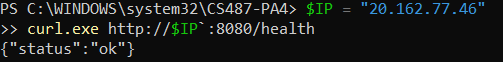

`curl.exe http://20.162.77.46:8080/health` returns `{"status":"ok"}` confirming the FastAPI validator is healthy and the LoadBalancer routes traffic correctly to the validator pod.

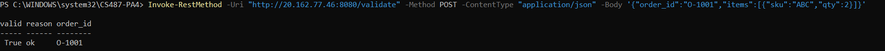

POST to `/validate` with `qty=2` returns `valid: True, reason: ok, order_id: O-1001` confirming the accepted path — orders with quantity ≤ 100 pass validation.

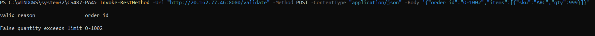

POST to `/validate` with `qty=999` returns `valid: False, reason: quantity exceeds limit, order_id: O-1002` confirming the `qty > 100` rejection rule works correctly.

### Evidence 5.5: Function App `VALIDATE_URL`

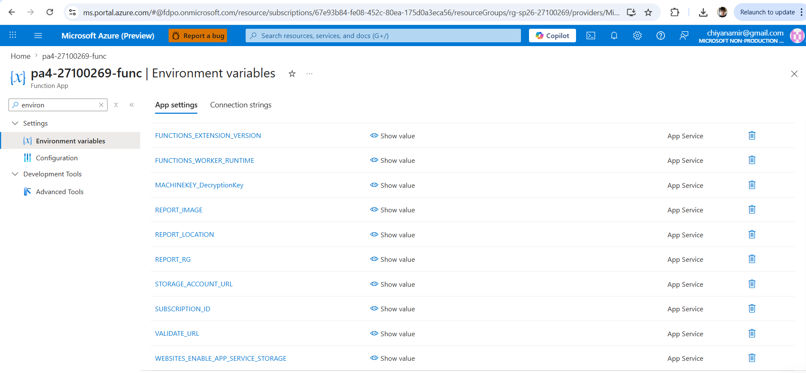

The Function App `pa4-27100269-func` Environment variables page shows `VALIDATE_URL` configured pointing to `http://20.162.77.46:8080/validate`, the AKS LoadBalancer external IP, allowing `validate_activity` to reach the AKS validator during every orchestration.

### Evidence 5.6: AKS Idle Behavior

The AKS node `aks-nodepool1-39806882-vmss000000` shows AGE of 2m51s and remains in Ready status regardless of whether orders are being processed. Unlike ACI, AKS has no scale-to-zero — the `Standard_B2s` node VM keeps running and billing even when there are no active orders.

---

## Task 6: ACI Report Job (15 points)

### Evidence 6.1: Blob Container

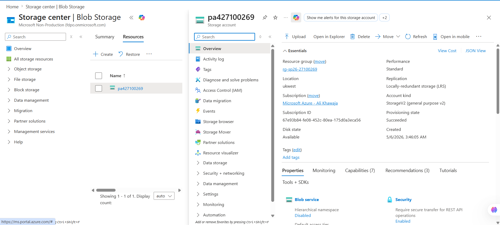

The Storage account `pa427100269` in resource group `rg-sp26-27100269`, UK West, with Provisioning state Succeeded. The `reports` blob container was created here and is where all generated PDFs are stored by the report-job ACI.

### Evidence 6.2: Manual ACI Run

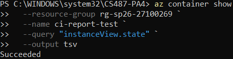

`az container show --query "instanceView.state"` returns `Succeeded` for `ci-report-test`, confirming the one-shot ACI lifecycle: the container started, did its work, and exited cleanly with a successful state rather than running indefinitely.

### Evidence 6.3: ACI Logs

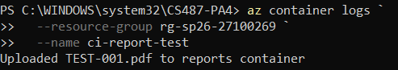

`az container logs` for `ci-report-test` prints `Uploaded TEST-001.pdf to reports container`, confirming the report job successfully generated the PDF using reportlab and uploaded it to blob storage using managed identity authentication.

### Evidence 6.4: Generated PDF

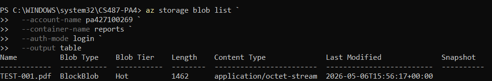

`az storage blob list` shows `TEST-001.pdf` in the `reports` container with size 1462 bytes and last modified `2026-05-06T15:56:17`, proving the ACI wrote its PDF output to blob storage successfully.

### Evidence 6.5: Function App Managed Identity and IAM

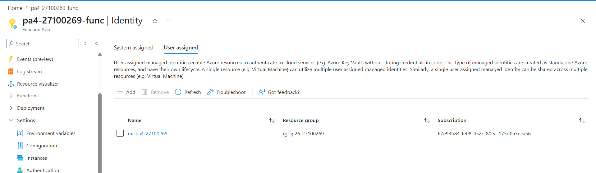

The Identity blade of `pa4-27100269-func` shows User-assigned identity `mi-pa4-27100269` attached from `rg-sp26-27100269`. This identity has the necessary permissions to create Container Instances, so `report_activity` can use `DefaultAzureCredential` to create ACIs without any secrets stored in code or config.

### Evidence 6.6: Report App Settings

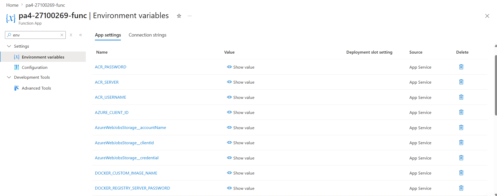

Function App settings showing `ACR_PASSWORD` (masked), `ACR_SERVER`, `ACR_USERNAME` used by `report_activity` to authenticate to ACR when creating the ACI, plus `AZURE_CLIENT_ID` and `AzureWebJobsStorage__*` settings for managed identity storage auth.

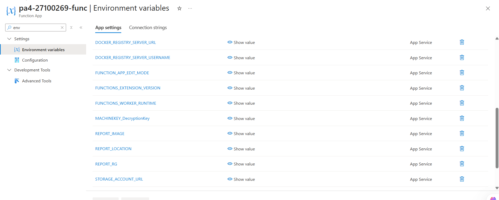

Function App settings showing `REPORT_IMAGE`, `REPORT_LOCATION`, `REPORT_RG` used by `report_activity` to create the ACI in the correct image, region, and resource group, plus `STORAGE_ACCOUNT_URL` for the report-job to write its PDF output.

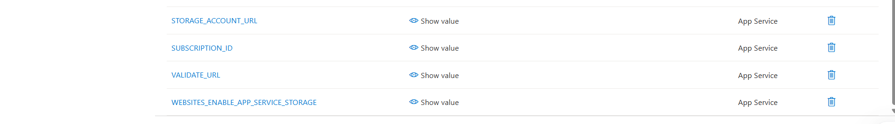

Function App settings showing `SUBSCRIPTION_ID` used to instantiate the `ContainerInstanceManagementClient`, `VALIDATE_URL` for the AKS validator endpoint, and `WEBSITES_ENABLE_APP_SERVICE_STORAGE` set to false for container mode.

---

## Task 7: End-to-End Pipeline (15 points)

### Evidence 7.1: Web App Wiring

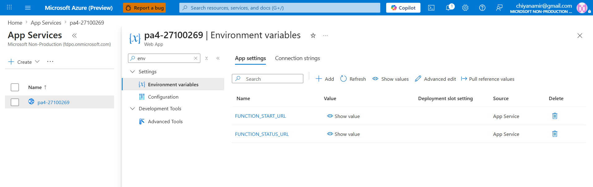

The Web App `pa4-27100269` Environment variables page shows `FUNCTION_START_URL` and `FUNCTION_STATUS_URL` configured, pointing to the deployed Durable Function App. `FUNCTION_START_URL` triggers the orchestration and `FUNCTION_STATUS_URL` is the prefix used by the frontend to poll orchestration status.

### Evidence 7.2: Happy Path UI

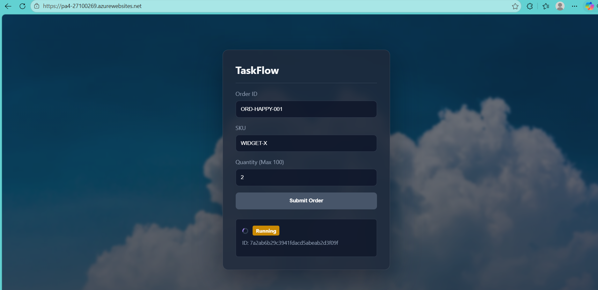

The TaskFlow web UI shows order `ORD-HAPPY-001` (SKU: WIDGET-X, qty: 2) in Running status with live instance ID `7a2ab6b29c3941fdacd5abeab2d3f09f`, confirming the orchestration started after Submit Order was clicked.

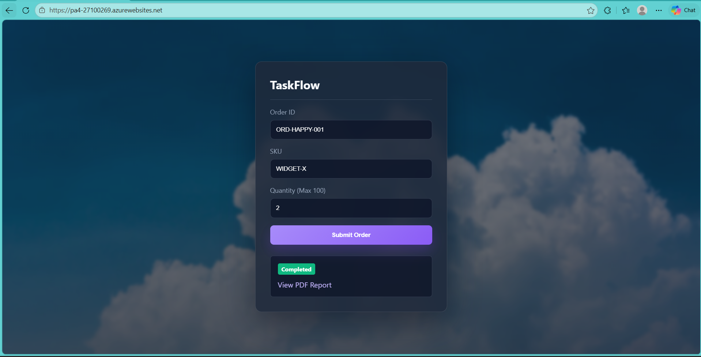

The TaskFlow web UI shows the orchestration Completed with a "View PDF Report" link, confirming the full pipeline ran end-to-end: validation passed, ACI created, PDF generated, uploaded to blob, and URL returned to the frontend.

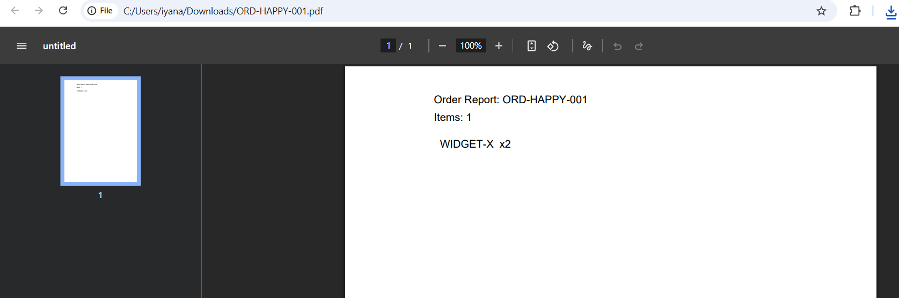

The generated PDF opened from blob storage shows `Order Report: ORD-HAPPY-001`, `Items: 1`, and `WIDGET-X x2`, confirming the report-job container correctly generated and uploaded the PDF with the correct order details.

### Evidence 7.3: Backend Participation

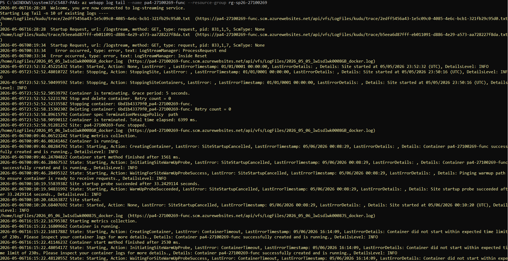

The `az webapp log tail` terminal captured during order submission shows the Function App container lifecycle and activity execution, confirming the Durable Function runtime was active during the end-to-end test.

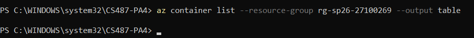

`az container list` shows an empty table after the happy path run, confirming the ACI `ci-report-ord-happy-001` was spawned and then auto-deleted by `report_activity` cleanup code after the PDF was uploaded. The same order `ORD-HAPPY-001` PDF is visible in blob storage.

The blob storage `reports` container shows the generated PDFs confirming the ACI wrote its output and the Durable orchestration traced the same order ID across all services.

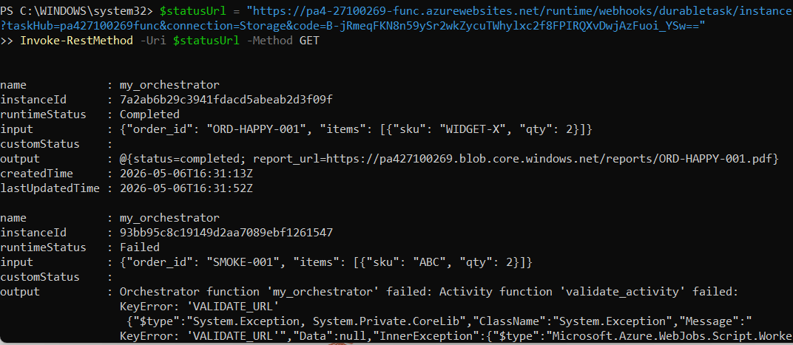

The status query output shows orchestration `7a2ab6b29c3941fdacd5abeab2d3f09f` with `runtimeStatus: Completed` and `output: {status=completed; report_url=https://pa427100269.blob.core.windows.net/reports/ORD-HAPPY-001.pdf}`, confirming all services participated and the same order ID traces through the entire pipeline.

### Evidence 7.4: Reject Path UI

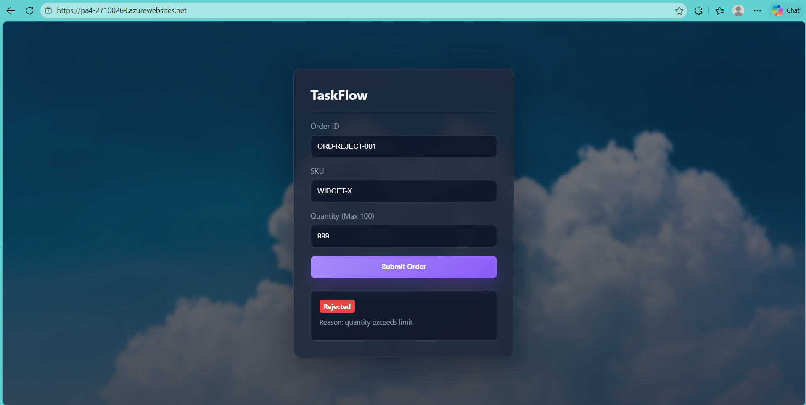

Order `ORD-REJECT-001` with `qty=999` shows Rejected with "Reason: quantity exceeds limit" in the UI, confirming the orchestrator correctly short-circuited after `validate_activity` returned `valid: false`. No report ACI was created for this order since `report_activity` is only called when validation passes.

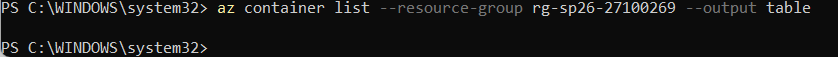

`az container list` after the reject path shows an empty table with no ACI instances, proving the orchestrator did not proceed to `report_activity` and no container was created for the rejected order.

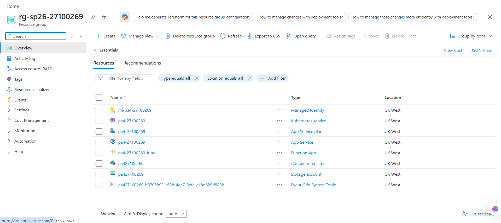

The resource group `rg-sp26-27100269` in UK West shows all deployed resources: Managed Identity `mi-pa4-27100269`, Kubernetes service `pa4-27100269`, App Service plan `pa4-27100269`, App Service `pa4-27100269`, Function App `pa4-27100269-func`, Container registry `pa427100269`, Storage account `pa427100269`, and Event Grid System Topic — confirming all PA services are deployed.

---

## Task 8: Write-up and Architecture Diagram (5 points)

### Evidence 8.1: Architecture Diagram

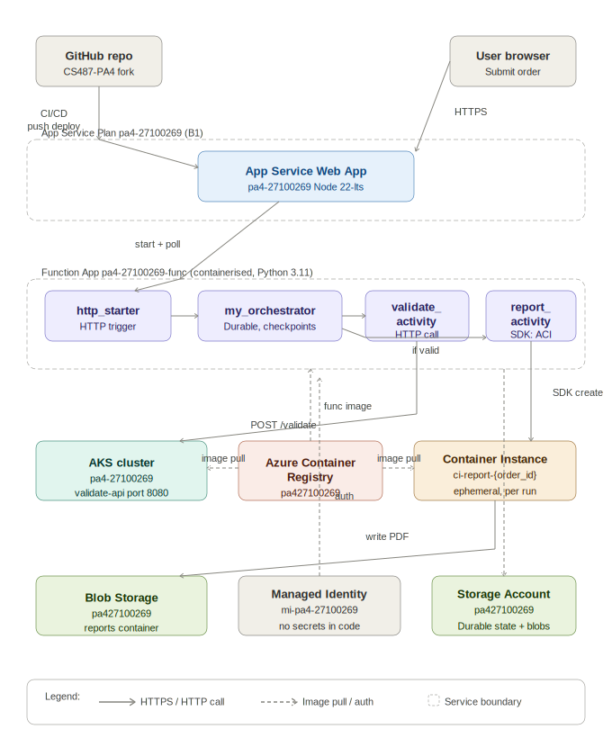

The architecture diagram shows all required components: GitHub CI/CD to App Service, Web App to Function App (start + status polling), Durable orchestrator calling AKS validator via HTTP POST /validate, orchestrator creating ephemeral ACI per run via SDK (labeled "ephemeral, per run"), ACI writing PDF to Blob Storage, ACR providing images to Function App, AKS, and ACI via image pull (dashed lines), and managed identity `mi-pa4-27100269` authenticating the Function App to Azure without secrets.

### Question 8.2: Service Selection

**App Service** is ideal for the TaskFlow web dashboard because it provides a long-running, always-on HTTPS endpoint with built-in CI/CD from GitHub. Unlike serverless options, it keeps the Node.js process warm so the UI loads instantly. The B1 tier gives predictable cost for a frontend with low but continuous traffic.

**Durable Functions** coordinate the multi-step pipeline — validate then report — while persisting state between steps. If the report-job ACI takes 60 seconds, a plain HTTP function would time out; Durable Functions checkpoint between activities so the runtime can replay safely. The container deployment also lets us bundle Python dependencies without worrying about cold-start package limits.

**AKS**: The validator is a long-lived HTTP microservice called on every order, so it needs a stable endpoint that is always ready. AKS provides a Kubernetes-managed pod with a LoadBalancer service, declarative deployment, and automatic restarts if the pod crashes — the right operational model for a persistent service. ACI cannot host a long-running service with a stable public IP in the same reliable way.

**ACI**: The report generator runs once per order, takes ~20 seconds, writes a PDF, and exits — a perfect fit for ACI's per-second billing. There is no idle cost because the container doesn't exist when it's not running. Deploying this as an AKS pod would waste a running container slot 24/7 for a job that runs for seconds.

### Question 8.3: ACI vs AKS

When AKS is idle for 10 minutes, the node VM (`Standard_B2s`) keeps running and billing — AKS has no scale-to-zero by default. "Idle" for ACI in this pipeline means the container literally does not exist; it is created per order and deleted after. If a malicious user spammed Submit 1000 times in a minute, ACI would incur the most cost because each valid order creates a brand-new container instance and bills for compute time; AKS just handles 1000 HTTP calls on the same always-running pod at no extra compute cost.

### Question 8.4: Durable Functions vs Plain HTTP

If validate and report were two plain HTTP functions calling each other, a network timeout during the 60-second ACI wait would cause the caller to fail with no way to resume. Durable Functions solve this by checkpointing state after each activity — if the host restarts mid-orchestration, it replays from the last checkpoint without re-running completed activities. A second concrete problem is that plain functions cannot easily branch on the validation result and persist that branch decision across a restart; the Durable orchestrator stores its full execution history in Azure Storage, so the conditional logic survives any interruption.

### Question 8.5: Cost Review

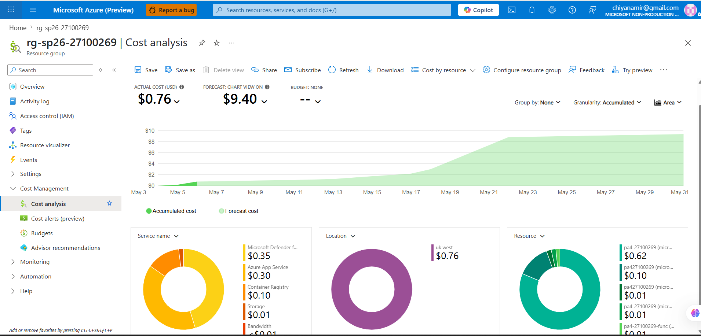

The Cost Analysis for `rg-sp26-27100269` shows actual cost of $0.76 with forecast $9.40 for May 2026. The most expensive service is Microsoft Defender at $0.35, followed by Azure App Service at $0.30, Container Registry at $0.10, and Storage at $0.01. The AKS cluster (`Standard_B2s` node) is the main ongoing cost driver as it bills continuously regardless of traffic — keeping it running 24/7 is the single largest expected expense for this PA.

### Question 8.6: Challenges Faced

**Challenge 1 — Python 3.14 worker type annotation incompatibility:** The Azure Functions Core Tools v4.9 uses a Python 3.14 worker locally which rejected the `client: df.DurableOrchestrationClient` type annotation with `FunctionLoadError`. I debugged this by reading the full error stack trace which pointed to the type validation in `functions.py`. The fix was removing the type annotation from the `client` parameter entirely, leaving it untyped, which satisfied both the local 3.14 worker and the cloud 3.11 runtime.

**Challenge 2 — Subscription security policies blocking AzureWebJobsStorage connection strings:** The Function App crashed after deployment with `ManagedIdentityCredential authentication unavailable` because the instructor's subscription blocks default storage connection string authentication. The TA announced the fix: replace `AzureWebJobsStorage` with three double-underscore settings (`AzureWebJobsStorage__accountName`, `AzureWebJobsStorage__credential=managedidentity`, `AzureWebJobsStorage__clientId`), forcing the runtime to authenticate via user-assigned managed identity instead of a connection string.

**Challenge 3 — PowerShell JSON quoting stripping double quotes from ORDER_JSON:** When passing `ORDER_JSON` to `az container create` inline from PowerShell, the shell stripped the double quotes from the JSON string causing the report-job to crash with `JSONDecodeError` three times in a row. I debugged this by checking `az container logs` each time. The fix was writing the container spec to a YAML file and using `az container create --file container.yaml` instead, which preserved the JSON string exactly.
